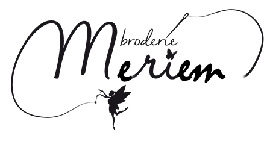
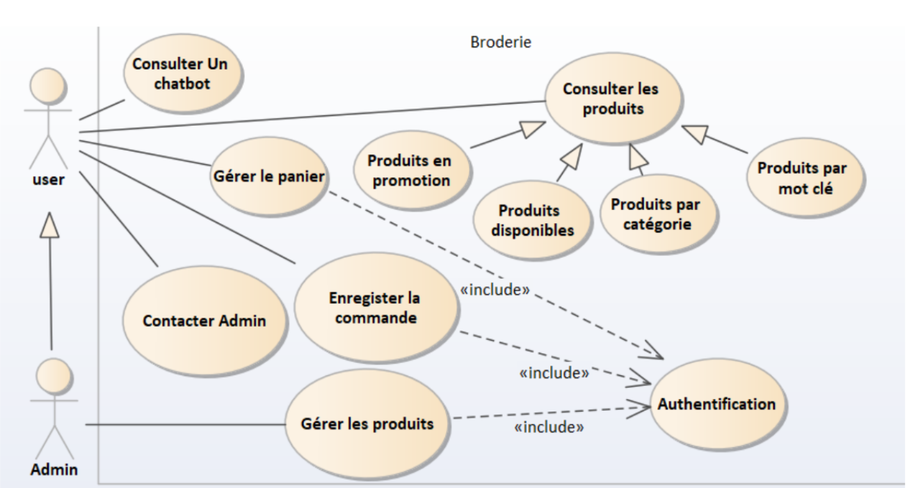
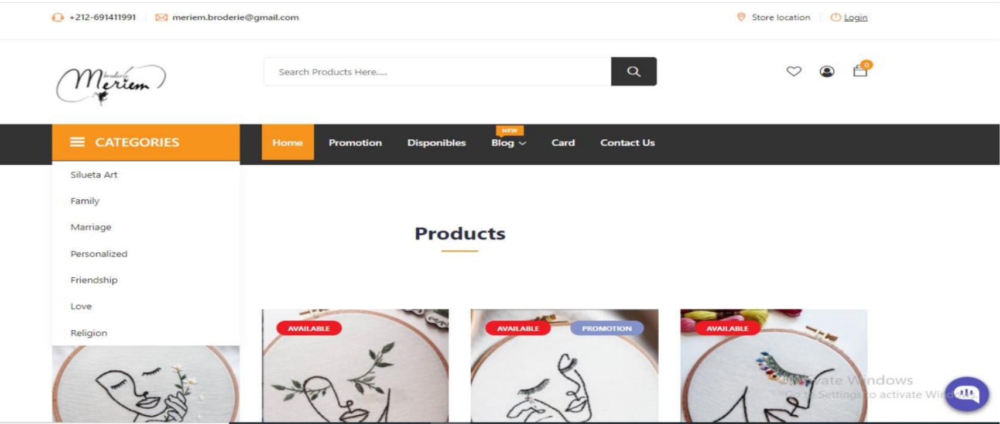
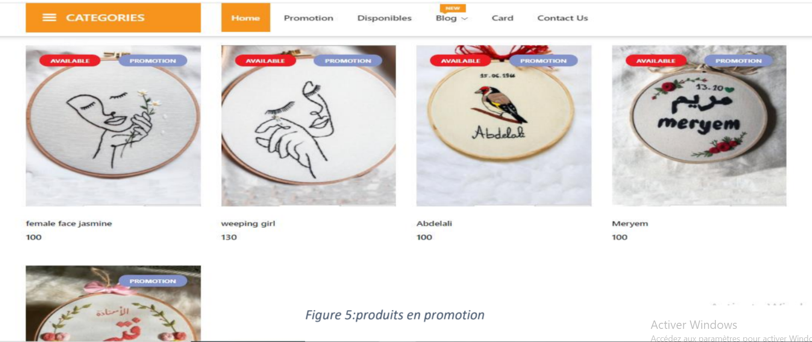

# Ecommerce_Angular :moneybag:

  
Description de projet
=============

Dans le cadre de la préparation du projet de fin de module « Développement de l’application web » à l’école nationale supérieure des arts et des métiers pour l’année universitaire 2020/2021, j’ai réalisé une application web « Meriem Broderie » pour vendre mes propres designs de broderie. 

:octocat: User Classes 
=============
L’application supportent deux acteurs : l’utilisateur de l’application et l’admin. Pour l’utilisateur il peut :
* Consulter tous les produits (en promotion, disponibles, par catégorie, par mot clé).
* Gérer le panier (Ajouter les produits dans un panier, supprimer).
* Enregistrer la commande.
* Contacter l’admin.
* Consulter un chatbot.
* S’authentifier.
Concernant l’Administrateur, il peut :
* Gérer les produits (Ajouter, modifier le produit, télécharger et modifier l’image d’un produit).
* S’authentifier.

  
:page_with_curl: Screenshots des  Interfaces 
=============

Page d’accueil  | Produits en promotions
------------ | -------------
   | 
Cette page contient deux barres de navigation, la première contient le logo de l’application, une barre de recherche et deux icones un pour le panier et l’autre pour s’authentifier. La deuxième barre contient la liste de catégorie, et d’autres paramètre pour naviguer. Concernant le centre de l’application, il contient les produits par toutes les catégories. | Si on clique sur promotion qui se trouve dans la barre de navigation, tous les produits qui sont en promotion seront affiché. Les images de produits en promotions contiennent un sticker bleu nommée promotion.
