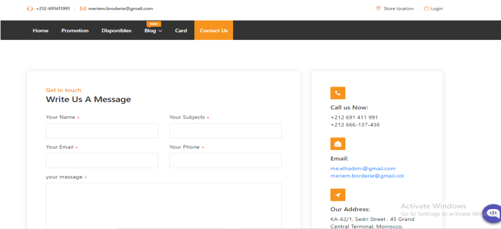
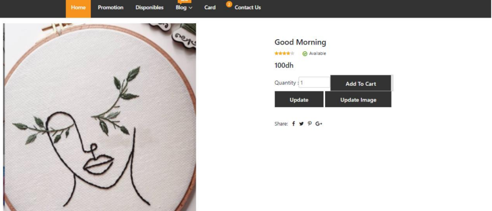
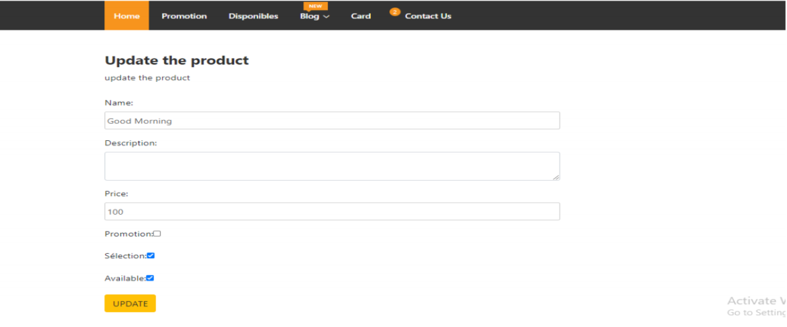
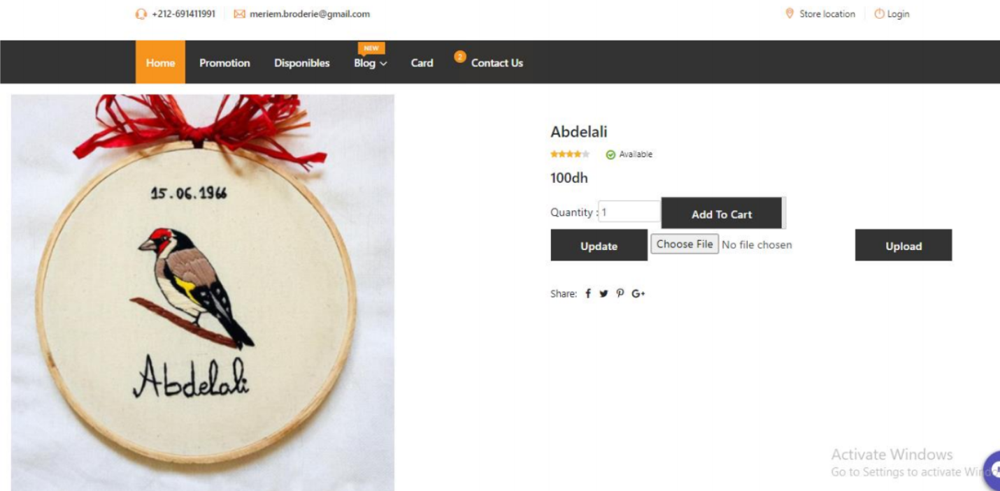

# Ecommerce_Angular :moneybag:

  
Description de projet
=============

Dans le cadre de la préparation du projet de fin de module « Développement de l’application web » à l’école nationale supérieure des arts et des métiers pour l’année universitaire 2020/2021, j’ai réalisé une application web « Meriem Broderie » pour vendre mes propres designs de broderie. 

:octocat: User Classes 
=============
L’application supportent deux acteurs : l’utilisateur de l’application et l’admin. Pour l’utilisateur il peut :
* Consulter tous les produits (en promotion, disponibles, par catégorie, par mot clé).
* Gérer le panier (Ajouter les produits dans un panier, supprimer).
* Enregistrer la commande.
* Contacter l’admin.
* Consulter un chatbot.
* S’authentifier.
Concernant l’Administrateur, il peut :
* Gérer les produits (Ajouter, modifier le produit, télécharger et modifier l’image d’un produit).
* S’authentifier.

  
:page_with_curl: Screenshots des  Interfaces 
=============

Page d’accueil  | 
------------ |
  | 
Cette page contient deux barres de navigation, la première contient le logo de l’application, une barre de recherche et deux icones un pour le panier et l’autre pour s’authentifier. La deuxième barre contient la liste de catégorie, et d’autres paramètre pour naviguer. Concernant le centre de l’application, il contient les produits par toutes les catégories. | 
  
 Produits en promotions|
------------ | 
| 
| Si on clique sur promotion qui se trouve dans la barre de navigation, tous les produits qui sont en promotion seront affiché. Les images de produits en promotions contiennent un sticker bleu nommée promotion.

Produits disponibles | produits selon la catégorie
------------ | -------------
   | 
Si on clique sur disponible qui se trouve dans la barre de navigation, tous les produits qui sont disponible seront affiché. Les images de ces produits contiennent un sticker rouge nommée available. | Il existe 7 catégories, vous pouvez spécifier la catégorie que vous voulez et les produits seront affichée.
  
  
 Chercher un produit | Pagination
------------ | -------------
   | 
Vous pouvez spécifier le nom de produit dans la barre de recherche et le produit sera affichée.| Les produits ne sont pas affichés toutes à la fois, mais ils sont regroupés par des pages.
  
  
 Chatbot| Footer
------------ | -------------
   | 
Vous pouvez consulter un chatbot pour avoir plusieurs informations concernant l’application.| Footer de l'application.

Contact us| Map
------------ | -------------
   | 
Vous pouvez envoyer un message à l’administrateur en spécifiant le nom, email, et l’objet de l’email.|Cette map contient la géolocalisation.

Description de produit| Le panier
------------ | -------------
   | 
Cette page contient le nom, la description, le prix et le nombre d’étoile de chaque produit. Vous pouvez spécifier la quantité de produit et l’ajouter dans un panier.|Il existe plusieurs paniers, vous pouvez choisir n’importe quel panier pour ajouter des produits, vous pouvez supprimer les produits dans un panier. La somme desprix de produits est calculée.

Checkout| Afficher La commande
------------ | -------------
   | 
Vous devez spécifier votre informations personnelles, l’adresse, le numéro téléphone pour finaliser votre commande.|Cette page affiche les détails de votre commande, pour la confirmer cliquer sur la Botton « Confirmer la Commande ».
  
  
  
Confirmer La commande| Login
------------ | -------------
   | 
Lorsque vous confirmer la commande, la date est automatiquement affectée.|Pour s’authentifier comme admin utiliser comme username : admin, password :1234.
  
  
  
Modifier le produit| Modifier les informations de produit.
------------ | -------------
   | 
Cette page est pour admin il contient deux boutons une pour modifier les informations de produit, et une pour modifier l’image de produits.|Cette page est pour admin il contient deux boutons une pour modifier les informations de produit, et une pour modifier l’image de produits
  
 Modifier l’image de produit
------------ |
   | 
Pour modifier l’image d’un produit, vous choisissez l’image dans votre ordinateur et faire upload pour télécharger l’image.|
  
 My Contact
=============

You can get in touch with me on my LinkedIn Profile:  https://www.linkedin.com/in/meriem-elhadi-574784189/

You can also follow my GitHub Profile to stay updated about my latest projects: 

If you liked the repo then please support it by giving it a star ⭐!

Issues
=============

If you face any issue, you can create a new issue in the Issues Tab and I will be glad to help you out.

License
=============

Copyright (c) 2018-present, ElhadiMeriem

 

 
  
  
